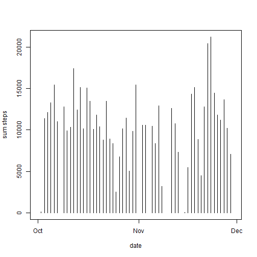
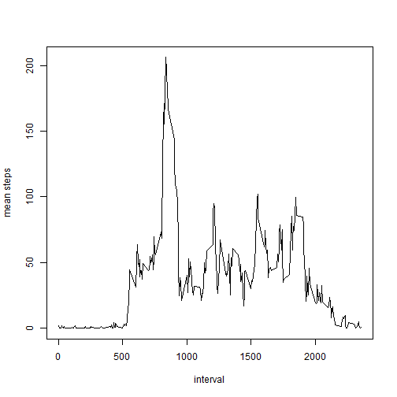
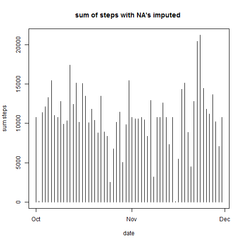

```r
setwd("C:/DATA/prive/R_Coursera/05 Reproducible")
act <- read.csv(file="activity.csv",header=T)
act$date<-strptime(act$date,"%Y-%m-%d")
library(plyr)
sumperday<-ddply(act,.(date),summarize,sum_steps=sum(steps))
#summaryperday<-ddply(act,.(date),summarize, mean_steps=mean(steps, na.rm=TRUE), median_steps=median(steps, na.rm=TRUE))
```

Histogram of the sum of the number of steps per day:


```r
plot(sumperday$date,sumperday$sum_steps ,type="h", xlab="date", ylab= "sum steps")
```

 

Mean of the number of steps per day:

```r
mean(sumperday$sum_steps, na.rm=TRUE)
```

```
## [1] 10766.19
```

Median of the number of steps per day:

```r
median(sumperday$sum_steps, na.rm=TRUE)
```

```
## [1] 10765
```

activity pattern:

```r
meanperinterval<-ddply(act,.(interval),summarize,mean_steps=mean(steps,na.rm=TRUE))
plot(meanperinterval$interval,meanperinterval$mean_steps ,type="l", xlab="interval", ylab= "mean steps")
```

 

max time interval:

```r
max<-max(meanperinterval$mean_steps)
subs<-meanperinterval[meanperinterval$mean_steps==max,]
maxinterval<-subs$interval
print(maxinterval)
```

```
## [1] 835
```

inputing missing values
total number of NAs:

```r
sum(is.na(act$steps))
```

```
## [1] 2304
```

fill NAs with average of interval:

```r
actnonna<-act
actnonna$date<-strptime(actnonna$date,"%Y-%m-%d")
for(i in 1:nrow(actnonna)) {
    if (is.na(actnonna$steps[i])){
        subs<-meanperinterval[meanperinterval$interval==actnonna$interval[i],]
        actnonna$steps[i]<-subs$mean_steps
    }
}
```

calculate total, mean, medain of steps per day:

```r
sumperday1<-ddply(actnonna,.(date),summarize, sum_steps=sum(steps, na.rm=TRUE))
plot(sumperday1$date, sumperday1$sum_steps, type="h", main="sum of steps with NA's imputed ", xlab="date", ylab= "sum steps")
```

 

As you can see, the plot looks a little different with NA's imputed.

mean and median:

```r
mean(sumperday1$sum_steps)
```

```
## [1] 10766.19
```

```r
median(sumperday1$sum_steps)
```

```
## [1] 10766.19
```

As you can see, the mean did not change because for the second calculation, the NA's were imputed by means.
The median changed slightly; it became the same value as the mean.
The total sums went up a bit because NA's dont add to a sum, but average estimates stayed the same because NA's were imputed by averages.

weekdays and weekends:

```r
Sys.setlocale("LC_TIME", "English")
```

```
## [1] "English_United States.1252"
```

```r
act$weekday<-weekdays(act$date,1)
for(i in 1:nrow(act)) {
if(act$weekday[i]=="Sat"|act$weekday[i]=="Sun")
    {act$weekend[i]<-"weekend"}
else{
    act$weekend[i]<-"weekday"}
}
avstps<-ddply(act,.(weekend, interval),summarize, av=mean(steps, na.rm=TRUE))
library(lattice)
xyplot(av ~ interval| weekend, 
           data = avstps,
           type = "l",
           xlab = "Interval",
           ylab = "Number of steps",
           layout=c(1,2))
```

 
library(knitr)
?knit2html() 
